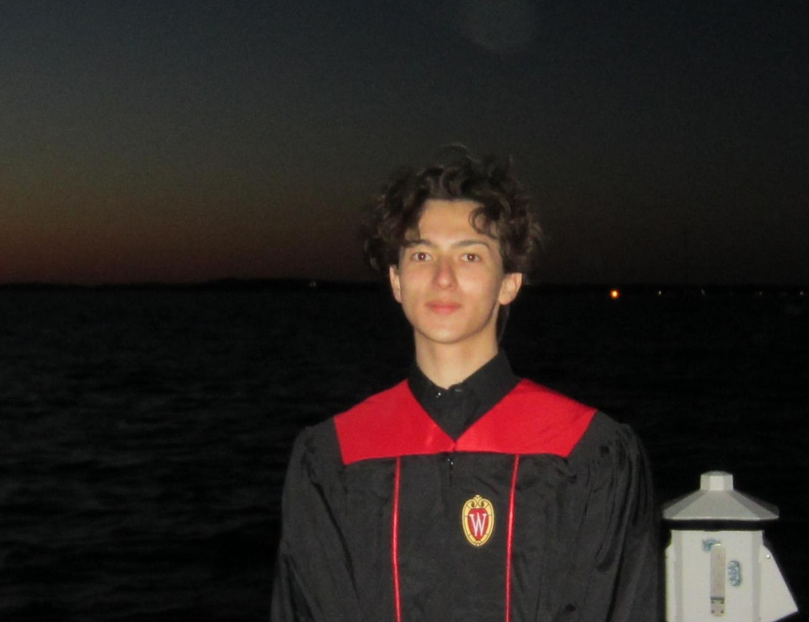

---
# Feel free to add content and custom Front Matter to this file.
# To modify the layout, see https://jekyllrb.com/docs/themes/#overriding-theme-defaults

layout: home
---

## Hi, I'm Samuel Pekofsky, a recent UW-Madison Graduate!

  

## This website serves as a personal repository for my resume and favorite projects.

Additionally, you may find blog posts and other info about me. All of this can be easily found through the bar at the top.

### To contact me, kindly use the mail or linkedin icons at the bottom of this page or refer to my resume :)